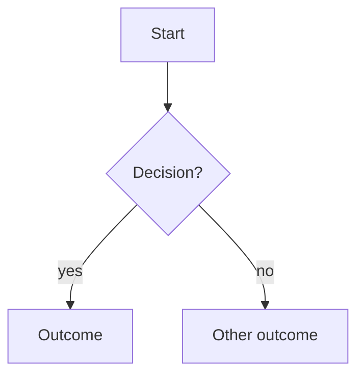

<!--
  TEMPLATE: FLOWS.md
  WHY: The atlas is prose-only; some journeys (wizards, billing lifecycles, render-
  decision trees) are far clearer as diagrams. This file holds Mermaid diagrams for
  those flows, in plain language so non-devs can read them. Copy into
  product-atlas/FLOWS.md. Derive every diagram from screen docs and cite them -
  never invent steps.
-->
# Flows - Visual journeys

> Mermaid diagrams of the journeys that are hard to read as prose. Each diagram is derived from the linked screen docs - keep them in sync when those change.

---

## [Flow name]

[One-line description.] Source: [screen doc](./screens/<route>/README.md).

[Optional: a few plain-language shortcuts or triage notes under the diagram.]

---

## How to add / update a flow

1. Derive from the screen README(s); cite the source. Don't invent steps.
2. `flowchart TD` for journeys, `stateDiagram-v2` for state machines, `sequenceDiagram` for request/response.
3. Plain-language node labels (read by support and PMs, not just devs).
4. Update the diagram in the same `rewrite` pass when the flow changes; snapshot per `MAINTENANCE.md`.
