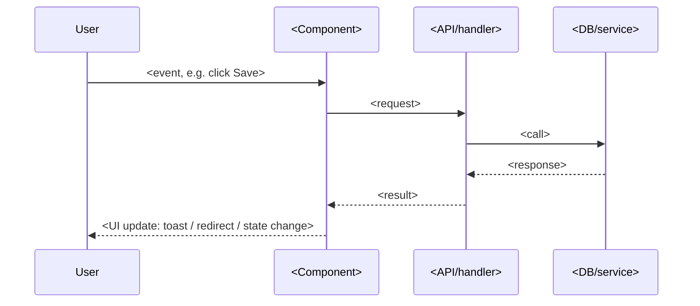

# <Feature Name>: Technical Flow

> Developer-only companion to `README.md`. Not plain-language, not loaded for any other persona.
> See `references/technical-flow-diagrams.md`. Generated: YYYY-MM-DD · Source: `<code_files>`

---

## <Action name>

<One or two sentences: what triggers this, in code terms.>

**Branches / edge cases in this flow:**
- `<condition>` → `<what happens instead>`
- `<error case>` → `<retry/fallback behavior>`

---

<!-- repeat the "## <Action name>" block for each non-trivial action on this feature -->

## Not diagrammed here

<One line per action on this feature that was skipped because it's trivial, e.g. "Toggle X: flips one boolean, re-renders, no branching." Keeps this file honest about what it does and doesn't cover, instead of silently omitting actions.>
